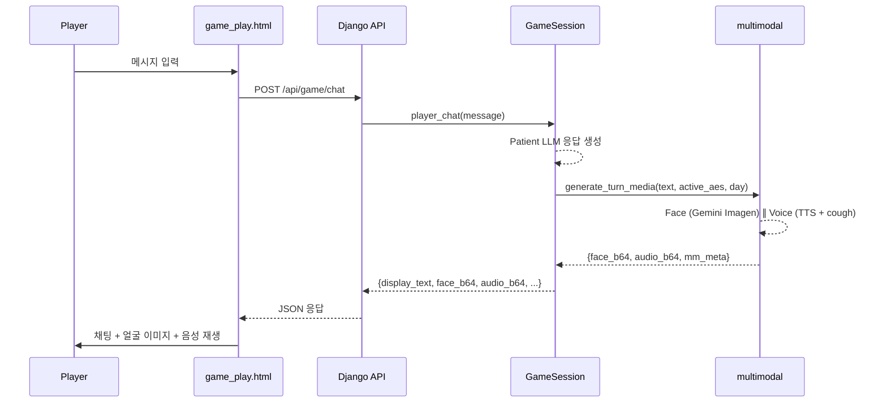

# 07. Interactive Game Mode — 간호사/의사 교육 시뮬레이션

> **파일:** `sim/game_session.py` (~780 lines)
> **역할:** Care Agent 자리에 사람을 넣어, 실시간 인터랙티브 환자 시뮬레이션
> **LLM 호출:** 그때그때 (환자 AI 응답 + 일별 GT 생성)
> **핵심:** 사람(간호사/의사 역할)이 Hospital Record만 보고 AE를 감지해야 함
>
> 🔗 **웹에서 확인:**
> - [게임 환자 선택](http://49.254.130.90:9000/game/20260216_062601_Padcev___Pembrolizumab_10pt_84d/) — 환자를 선택하여 게임 시작
> - [PT-001 게임 플레이](http://49.254.130.90:9000/game/20260216_062601_Padcev___Pembrolizumab_10pt_84d/PT-001/) — 간호사 역할로 환자와 실시간 대화

---

## 1. 설계 목적

```
기존 시뮬레이션: 모든 것이 자동 (Care Agent LLM이 간호사 역할)
게임 모드:       사람이 간호사 역할, 환자 AI와 직접 대화

→ 임상시험 간호사/의사 교육 도구
→ AI Care Agent의 가치를 체감적으로 이해
→ MedGemma Challenge 웹 데모의 인터랙티브 요소
```

---

## 2. 아키텍처: Care Agent 교체

```
┌─────────────────────────────┐     ┌─────────────────────────────┐
│  Automated Mode              │     │  Game Mode                   │
│                              │     │                              │
│  DailySimulator              │     │  DailySimulator              │
│      ↓ GT                    │     │      ↓ GT                    │
│  CareAgent (LLM)             │     │  Human Player (웹 브라우저)   │
│      ↓ 4-turn                │     │      ↓ 무제한 turn            │
│  ObservationModel            │     │  ObservationModel            │
│      ↓ HR                    │     │      ↓ HR                    │
│  Dose Modification           │     │  Dose Modification           │
└─────────────────────────────┘     └─────────────────────────────┘
```

**동일한 부분:** DailySimulator, ObservationModel, Dose Modification, Hazard Functions
**다른 부분:** 간호사 역할이 LLM → 사람으로 교체, 대화 턴 수 무제한

---

## 3. GameSession 클래스

### 3.1 세션 생성

```python
class GameSession:
    def __init__(self, rule_set, patient, total_days=84, seed=42, model=DEFAULT_MODEL):
        self.session_id = str(uuid.uuid4())[:8]
        
        # 핵심 엔진 (자동 모드와 동일)
        self.simulator = create_simulator(rule_set, patient, sampler, model)
        self.mood = MoodState(persona_type, seed=seed + 20000)
        self.observation_model = ObservationModel(mood, sampler, care_ai_enabled=True)
        
        # 게임 상태
        self.status = "ready"  # ready → chatting → finished
        self.current_day = 0
        self.force_hospital_tomorrow = False
```

**Seed 전략:** `seed + patient_num + 10000` (기본 offset) — 자동 모드와 독립적 난수열.

### 3.2 인메모리 세션 관리

```python
_active_sessions: dict[str, GameSession] = {}

def get_session(session_id: str) -> GameSession | None
def list_sessions() -> list[dict]
```

서버 재시작 시 세션 소실. 프로토타입 수준의 구현 — 프로덕션에서는 Redis/DB 필요.

---

## 4. 게임 루프 상태 머신

```
[Start] → ready
   │
   ▼ advance_day()
chatting ──────────────────┐
   │                        │
   │ patient_greet()        │ skip_day()
   │ player_chat() × N      │
   │                        │
   ▼ end_chat_and_submit()  │
ready ◄─────────────────────┘
   │
   ▼ (사망/중단/마지막날)
finished → reveal_ground_truth()
```

---

## 5. 핵심 메서드 상세

### 5.1 `advance_day()` — 하루 전진

**알고리즘:**
1. `current_day += 1`
2. Cycle info 계산 (`cycle`, `cycle_day`)
3. 병원 방문일 판단: `_is_hospital_day()` OR `force_hospital_tomorrow`
4. **GT 생성:** `simulator.generate_day()` (hazard function + LLM for event days)
5. **Observation:** `observation_model.process_day()` → HR 생성
6. HR만 플레이어에게 반환 (GT는 숨김)

**반환 데이터:**
```json
{
  "day": 5, "cycle": 1, "cycle_day": 5,
  "is_hospital": false,
  "is_event_day": true,
  "hospital_record": {
    "objective": {
      "labs": {"ANC": {"value": 4.2}},     // 방문 없으면 stale
      "active_aes": [{"ae": "nausea", "grade": 1}],
      "ecog": 1
    }
  },
  "events_summary": "이벤트 발생일 | 알려진 AE: nausea Gr1",
  "can_chat": true,
  "needs_decision": false,
  "mood_snapshot": {"anxiety": 0.35, "defensiveness": 0.65, ...}
}
```

**플레이어가 볼 수 없는 것:**
- GT의 실제 AE grade (HR은 distortion 적용)
- 아직 감지되지 않은 AE
- 종양 변화 (스캔 전)
- 사망 확률

### 5.2 `patient_greet()` — 환자의 첫 인사

**Care Agent T1과 동일한 Patient LLM 사용:**
- GT 기반으로 환자가 느끼는 증상 보고
- Mood에 따라 과소/과대 보고
- 영상에서 보이는 징후 (video_visible) 포함

**한국어 출력:**
```json
{
  "role": "patient",
  "greeting": "안녕하세요, 간호사님. 오늘은 좀 속이 안 좋아요...",
  "reported_symptoms": [
    {"symptom": "속이 메스꺼움", "severity": "mild", "duration": "3일째"}
  ],
  "video_visible": ["slight pallor", "fatigue visible"]
}
```

### 5.3 `player_chat(message)` — 사람의 질문 → 환자 AI 응답

**흐름:**
1. 플레이어 메시지를 대화 기록에 추가
2. 전체 대화 컨텍스트 구축 (`[간호사]: message`, `[환자]: ...`)
3. Patient LLM에 GT + 대화 컨텍스트 전달
4. 환자 AI 응답 생성

**부분 드러남(Partial Revelation) 규칙:**
```
환자가 숨기고 있던 증상에 대해 물으면:
  → "음... 사실 좀 그런 게 있긴 해요" (partial)
  → mood 업데이트: defensiveness -0.05, anxiety +0.02

존재하지 않는 증상에 대해 물으면:
  → "아뇨, 그런 건 없어요" (full denial)

시각 요청에 대해 (video_cooperation에 따라):
  → 협조: "여기 좀 보여드릴게요" + visible 징후
  → 거부: "잘 안 보일 것 같은데요..."
```

**무제한 턴:**
- 자동 Care Agent는 4턴 고정
- 게임 모드는 `player_chat()`을 원하는 만큼 호출 가능
- 더 많이 대화할수록 mood가 변화 → 점진적으로 정보 드러남

### 5.4 `end_chat_and_submit(observations, actions)` — 결정 제출

**플레이어 입력:**
```json
{
  "observations": [
    {"ae_term": "nausea", "estimated_grade": 2, "source": "patient_report"},
    {"ae_term": "rash_maculopapular", "estimated_grade": 1, "source": "video"}
  ],
  "actions": [
    {"action": "recommend_conmed", "detail": "anti-nausea medication", "reason": "Grade 2 nausea"},
    {"action": "recommend_early_visit", "detail": "rash evaluation", "reason": "new rash detected"}
  ]
}
```

**처리 과정:**
1. `care_record` 포맷으로 변환 (자동 모드와 동일 구조)
2. `apply_interventions()` 실행 → 보조약 추가
3. `force_hospital_tomorrow` 설정 (필요 시)
4. **Observation Model 재실행** → Care record 포함하여 HR 갱신
5. 병원 방문일이면 dose modification 적용 (HR 기반)
6. 결과 기록 (day_results, gt_history, hr_history, player_actions_log)
7. 종료 조건 체크 (사망, 중단, 마지막 날)

### 5.5 `skip_day()` — 대화 없이 건너뛰기

```python
def skip_day(self):
    return self.end_chat_and_submit(observations=[], actions=[])
```

Natural mode와 동일한 효과 — Care AI 없는 날.

### 5.6 `reveal_ground_truth()` — 게임 종료 후 성적표

**스코어카드 알고리즘:**

각 GT AE에 대해:
```
점수 = max(2, 10 - delay_days)

delay_days = player_detected_day - gt_onset_day
  0일 지연 → 10점 (만점)
  1일 지연 → 9점
  5일 지연 → 5점
  8일+ 지연 → 2점 (최저)
  감지 못함 → 0점
```

**반환 데이터:**
```json
{
  "gt_ae_timeline": {
    "nausea": {"onset_day": 3, "max_grade": 2},
    "rash_maculopapular": {"onset_day": 12, "max_grade": 3},
    "peripheral_neuropathy": {"onset_day": 42, "max_grade": 2}
  },
  "player_detections": {
    "nausea": {"detected_day": 5, "estimated_grade": 1},
    "rash_maculopapular": {"detected_day": 14, "estimated_grade": 2}
  },
  "scorecard": [
    {"ae": "nausea", "gt_onset": 3, "gt_max_grade": 2, "player_detected": 5, "delay_days": 2, "score": 8},
    {"ae": "rash_maculopapular", "gt_onset": 12, "gt_max_grade": 3, "player_detected": 14, "delay_days": 2, "score": 8},
    {"ae": "peripheral_neuropathy", "gt_onset": 42, "gt_max_grade": 2, "player_detected": null, "delay_days": null, "score": 0}
  ],
  "total_score": 16,
  "max_score": 30,
  "score_pct": 53.3,
  "simulator_summary": {
    "occurred_aes": ["nausea", "rash_maculopapular", "peripheral_neuropathy"],
    "tumor_response": "partial_response",
    "ecog_change": "1 → 2"
  }
}
```

---

## 6. 코드 재사용

| 컴포넌트 | 자동 모드 | 게임 모드 | 동일? |
|---------|----------|----------|------|
| DailySimulator | ✓ | ✓ | 동일 |
| Hazard Functions | ✓ | ✓ | 동일 |
| ObservationModel | ✓ | ✓ | 동일 |
| MoodState | ✓ | ✓ | 동일 |
| apply_interventions() | ✓ | ✓ | **동일 함수** |
| Patient LLM 프롬프트 | care_agent 내부 | game_session 내부 | 유사 (한국어 출력) |
| Nurse 역할 | Nurse LLM | **사람** | 교체 |
| 턴 수 | 4턴 고정 | 무제한 | 다름 |
| Dose Modification | 오케스트레이터 | game_session 내부 | 로직 동일 |

---

## 7. 기술적 구현 세부사항

### 7.1 세션 팩토리

```python
def create_game_session(run_id, patient_id, total_days=84, seed=42, data_dir="data"):
    # data/runs/{run_id}/rule_set.json 로드
    # data/runs/{run_id}/patients/{patient_id}.json 로드
    return GameSession(rule_set, patient, total_days, seed)
```

기존 시뮬레이션 run의 rule_set과 환자 데이터를 재사용.

### 7.2 Retry 로직

```python
# advance_day() 내부:
for attempt in range(3):
    try:
        result = self.simulator.generate_day(...)
        break
    except Exception as e:
        if attempt == 2:
            raise
        time.sleep(1)
```

LLM의 일시적 실패에 대비한 3회 재시도.

### 7.3 정보 차단

```python
# advance_day()가 반환하는 것: HR만
return {
    "hospital_record": observed["hospital_record"],  # HR
    # GT는 여기 없음!
}

# reveal_ground_truth()만 GT 공개:
return {
    "gt_history": self.gt_history,  # 전체 GT 이력
}
```

---

## 8. API 엔드포인트 (Django)

| 엔드포인트 | 메서드 | 기능 |
|-----------|--------|------|
| `POST /api/game/start` | `api_game_start` | 세션 생성, session_id 반환 |
| `POST /api/game/advance` | `api_game_advance` | 하루 전진, HR 반환 |
| `POST /api/game/greet` | `api_game_greet` | 환자 AI 첫 인사 |
| `POST /api/game/chat` | `api_game_chat` | 사람 메시지 → 환자 AI 응답 |
| `POST /api/game/end-chat` | `api_game_end_chat` | 관찰/행동 제출 |
| `POST /api/game/skip` | `api_game_skip` | 대화 없이 건너뛰기 |
| `GET /api/game/reveal/<sid>/` | `api_game_reveal` | GT 공개 + 성적표 |
| `GET /api/game/sessions` | `api_game_sessions` | 활성 세션 목록 |

모든 POST 엔드포인트는 `@csrf_exempt` (프로토타입). 프로덕션에서는 CSRF 토큰 필요.

---

## 9. Multimodal 통합 — 얼굴 이미지 + 음성 TTS

### 9.1 아키텍처

시뮬레이션 파이프라인은 텍스트 기반으로 변경 없음. **게임 플레이 시에만** 매 환자 턴마다 얼굴 이미지와 음성을 실시간 생성하여 채팅 UI에 표시.



### 9.2 핵심 설계 결정

| 항목 | 결정 | 이유 |
|------|------|------|
| 생성 시점 | 게임 플레이 시에만, 매 턴 | 시뮬레이션 데이터에는 불필요 |
| 얼굴 캐시 | Baseline 1회 생성 → AE 변화 시에만 재생성 | Gemini API 비용 절감 |
| 음성 범위 | TTS + 기침 클립 삽입 | 분석(STT)은 향후 확장 |
| API 키 | `.env`의 `GOOGLE_API_KEY` 공유 | 별도 키 불필요 |
| 실패 시 | 텍스트 전용 모드로 degradation | 멀티모달 없어도 게임 가능 |
| 전달 방식 | base64 인코딩 (JSON 내 인라인) | 별도 파일 서빙 불필요 |

### 9.3 `MultimodalGameBridge` (`sim/multimodal/game_bridge.py`)

```python
class MultimodalGameBridge:
    def __init__(self, patient_json, *, config=None, enabled=True):
        self.profile = SimPatientProfile.from_sim_patient(patient_json)
        self._baseline_face_b64 = None      # 캐시
        self._last_visual_ae_key = ""        # AE 변화 감지용

    def generate_turn_media(self, text, active_aes, day) -> dict:
        """한 턴의 얼굴 이미지 + 음성을 병렬 생성.
        Returns {"face_b64": str|None, "audio_b64": str|None, "mm_meta": dict}
        """
```

**캐시 전략:**

```
Day 1 (AE 없음)     → Baseline 생성 + 캐시          (API 1회)
Day 2-20 (AE 없음)  → 캐시된 Baseline 재사용          (API 0회)
Day 21 (rash G1)     → AE overlay 새로 생성 + 캐시    (API 1회)
Day 22 (rash G1 유지) → 캐시 재사용                    (API 0회)
Day 25 (rash G2)     → AE 변경 감지 → 새 overlay 생성  (API 1회)
```

Face와 Voice 생성은 `ThreadPoolExecutor`로 병렬 실행 → 총 대기 시간 = max(face, voice).

### 9.4 GameSession 연결

```python
# GameSession.__init__
self._mm_bridge = None
try:
    from src.multimodal.game_bridge import MultimodalGameBridge
    self._mm_bridge = MultimodalGameBridge(patient, enabled=True)
except Exception:
    pass  # multimodal 없어도 게임 진행 가능

# patient_greet() / player_chat()
if self._mm_bridge:
    media = self._mm_bridge.generate_turn_media(
        text=greeting_text,
        active_aes=day_result.get("AE", []),
        day=day,
    )
    response.update(media)  # face_b64, audio_b64, mm_meta 추가
```

Django API views (`api_game_greet`, `api_game_chat`)는 `session.patient_greet()` 결과를 그대로 `JsonResponse`로 반환하므로 **추가 수정 불필요**.

### 9.5 프론트엔드 (game_play.html)

**Video Header 영역:**
```
┌─────────────────────────────────────────────────┐
│ [얼굴 이미지 48×48]  PT-001  Connected  [🔊] [☐Auto] │
└─────────────────────────────────────────────────┘
```

- 얼굴 이미지: baseline 로딩 시 스피너 표시, 생성 완료 시 교체
- 오디오: 헤더의 Play 버튼 + 각 메시지의 인라인 Replay 버튼
- Auto-play 토글: 체크 시 환자 메시지마다 자동 재생

**`addPatientMsg(text, videoVisible, faceB64, audioB64)`:**
```
환자 메시지 텍스트                      [🔊 Replay]
On camera: slight pallor, fatigue
```

### 9.6 성능 벤치마크

| 요청 | Face | Voice | 총 응답 시간 |
|------|------|-------|-------------|
| 첫 greet (baseline 생성) | ~35s (Imagen) | ~5s (TTS) | ~40s |
| 후속 chat (face 캐시 hit) | 0s | ~3s (TTS) | ~5s |
| AE 변화 시 chat | ~35s (Imagen) | ~3s (TTS) | ~35s |

### 9.7 파일 구조

```
sim/multimodal/
├── game_bridge.py       ← 게임↔멀티모달 브릿지 (NEW)
├── config.py            ← GOOGLE_API_KEY fallback 추가
├── schemas.py           ← SimPatientProfile, SimAE 어댑터
├── face_generator.py    ← Gemini Imagen 얼굴 생성
├── voice_generator.py   ← TTS + 기침 클립 삽입
├── face_analyzer.py     ← MedSigLIP 분석 (향후)
└── voice_analyzer.py    ← HeAR 분석 (향후)
```